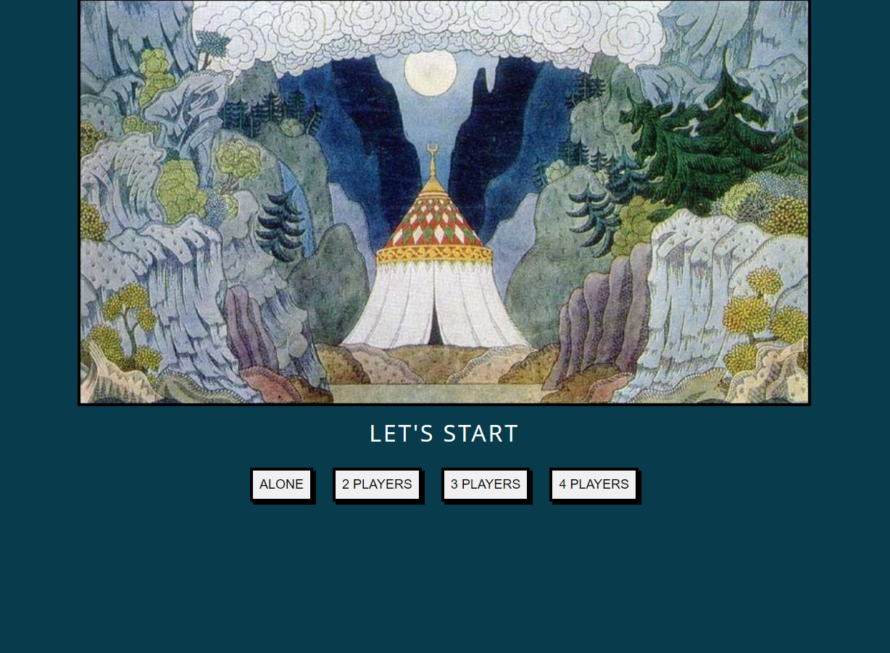

# Game: who has a better memory?

It is a simple browser game that can help you to test your memory.

The game used illustrations by a famous Russian artist [Ivan Bilibin](https://en.wikipedia.org/wiki/Ivan_Bilibin)

[Click here](https://voluble-pithivier-923960.netlify.app/) to play the game
## Rules of the game:

There are 40 cards in total, 20 unique pictures. Сhoose any 2 cards and click on them.

If the pictures are the same you get one point

After a couple of seconds, the cards will turn over and the move will pass to the opponent

This project was bootstrapped with [Create React App](https://github.com/facebook/create-react-app).

## How to run it locally

In the project directory, you can run:

### `npm start`

Runs the app in the development mode.\
Open [http://localhost:3000](http://localhost:3000) to view it in the browser.

The page will reload if you make edits.\
You will also see any lint errors in the console.